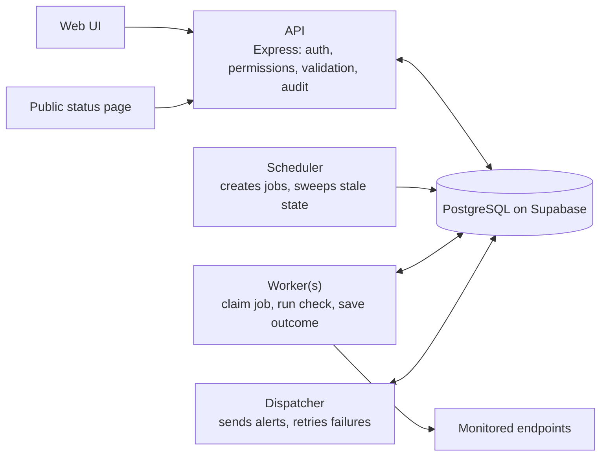
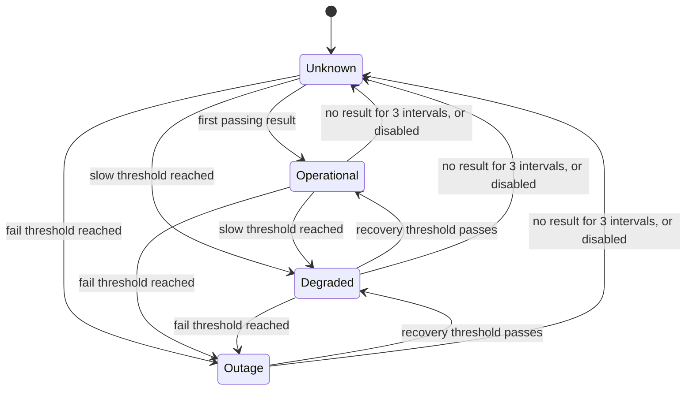
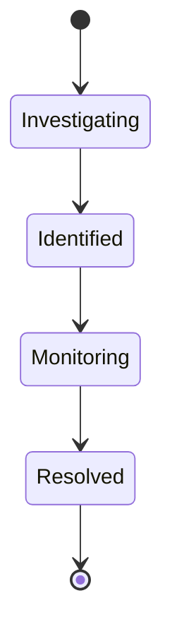

# Status Pulse: Architecture

> **Requirement: Architecture sketch.** Read the overview and the system diagram first, then the table of concurrency guarantees. The data model is in [erd.md](erd.md).

## Overview

Status Pulse is four small programs that share one PostgreSQL database. The database is the referee: every "exactly once" rule in the requirements is a constraint in Postgres, so it still holds when two programs race each other.



## Code layout

One package, one `package.json`, folders by process. Each process has its own entry file. Code is compiled with `tsc` to `dist/` and run with `node`.

```
src/
  api/         Express app: routes, middleware            entry: api/main.ts
  scheduler/   tick loop and sweeper                      entry: scheduler/main.ts
  worker/      claim a job, run the check, save outcome   entry: worker/main.ts
  dispatcher/  deliver alerts from the outbox             entry: dispatcher/main.ts
  core/        status rules, state machines, URL safety (no database access)
  db/          Prisma client and the raw SQL queries
prisma/        schema and migrations
```

`core/` never imports from `db/`, so the rules can be tested without a database.

## The four processes

| Process | Does | Why separate |
|---|---|---|
| **API** | Registration, login, projects, services, results, incidents, alerts, public page | It serves users and must stay responsive no matter what the checks are doing |
| **Scheduler** | Once a second, inserts one job per enabled service for the current interval slot. Also sweeps: marks stale jobs skipped, moves services with no recent result to Unknown, ends expired overrides | A tick loop with no other work |
| **Worker** | Claims a job, calls the endpoint under a hard timeout, then saves result, status, incident and alert in one transaction | A slow endpoint must only slow one worker. Run more workers to scale. |
| **Dispatcher** | Claims undelivered alerts from the outbox, sends them, retries failures with backoff | A failing mail provider must never delay checks |

For the shared test environment, one launcher script starts all four processes inside one web service.

## Life of a check

1. The scheduler inserts a job for the current slot. Slots are aligned to the Unix epoch, so every scheduler computes the same slot, and the unique rule on (service, slot) turns duplicates into no-ops.
2. A worker claims the oldest job of the current slot with a lease, using `FOR UPDATE SKIP LOCKED`, so two workers never get the same job.
3. The worker calls the endpoint under a hard timeout. No database lock is held while it waits.
4. The worker opens a transaction and locks the service row (`FOR UPDATE`).
5. Inside that transaction it saves the result, calls `evaluate` to compute the status, and, if the status entered Outage with no override active, opens the incident and creates the alert.
6. The transaction commits and the job is marked done.
7. The dispatcher sends the alert and sets `delivered_at` only after a confirmed send.

A crash at any point before the commit leaves nothing half-written. The lease expires, and another worker retries the job if its slot is still current.

## Status

Status is calculated when something happens, stored, and recorded in a history table. A status is therefore a stored fact that a page can read cheaply, and a change in status can open an incident even when nobody is looking.

It changes in three kinds of moment, and all three go through one function, `evaluate`, which reads recent results, the active override and the current time and returns a status. It does no database access.

| Moment | Handled by |
|---|---|
| A check result arrives | Worker |
| The owner acts: override set or cancelled, service disabled or enabled, thresholds edited | API |
| Time passes: no result for three intervals, override expires | Sweeper in the scheduler |

Every one of them locks the service row first, so two of them cannot decide at once.



- **Thresholds belong to the service** and are set by the owner: consecutive failures for Outage, consecutive passes for recovery, a latency limit for slow, and how many slow results in a row make Degraded.
- **Streaks restart whenever a service enters Unknown.** Only results recorded after the latest Unknown transition count, so no counter needs to be kept in sync.
- **An override replaces the displayed status** while it is active. Results are still recorded, but no new incident or alert is created. An incident already open is untouched.
- **No catch-up after downtime.** A job is only worth running while its slot is current. Stale jobs are marked skipped, so a restarted worker runs one check and then follows the interval. A scheduler that was down never created the missed jobs, because it always computes the slot from the present.

## Incident lifecycle



No skipping and no going back; anything else returns 409. The system opens incidents but never resolves them. An incident takes its service's visibility, and an incident on a private service is never public.

## Concurrency guarantees

Each row is a requirement, the mechanism that enforces it, and the test that proves it.

| Guarantee | Mechanism | Test |
|---|---|---|
| One job per service per slot | Epoch-aligned slot + `UNIQUE (service_id, scheduled_for)` | Several schedulers tick at once: one row per slot |
| A job is run by one worker | `FOR UPDATE SKIP LOCKED` with a lease | Many workers drain a queue: every job claimed once |
| A crashed worker's job is retried | Lease expiry | Claim, wait out the lease, claim again |
| A retry creates no second result | `UNIQUE (job_id)` on results | Complete the same job twice: one result |
| No catch-up flood after downtime | Claim only current-slot jobs; sweeper skips stale ones | Twenty stale jobs queued: one check runs |
| Two status decisions cannot interleave | Row lock on the service | Override and result arrive together: consistent outcome |
| One incident per outage | Partial unique index: one non-resolved incident per service | Two workers fail the same service: one incident |
| One alert per problem | `UNIQUE (service_id, incident_id, state)` | Repeat the trigger: one alert |
| Never falsely delivered | `delivered_at` set only after confirmed send | Forced send failure: still null, retryable |
| Charged once | `UNIQUE (project_id, idempotency_key)` | Same key twice: one activation |
| Removed members lose access at once | Role read from the database on every request | Demote a member: next request is refused |
| Private data stays private | Public routes read only public rows; row level security on every table | Private service absent from the public API |

## Security

- **Passwords:** bcrypt at cost 12, passwords capped at 72 bytes because bcrypt ignores anything longer.
- **Sessions:** a 15-minute signed access token that carries only who the user is, and a random refresh token stored as a hash and replaced on every use. A reused old refresh token revokes all of that user's sessions.
- **Permissions:** the role is read from the memberships table on every request. A non-member gets 404, and a member with the wrong role gets 403.
- **Endpoint URLs:** validated when saved. The worker checks again when connecting: it resolves the name itself, rejects private, loopback and link-local addresses, and connects to the address it just checked. Redirects are not followed. The check is repeated because a name can point somewhere safe at save time and somewhere internal later.
- **Credentials:** encrypted at rest with AES-256-GCM, never returned by the API, never logged. Only the worker decrypts them.
- **Logs:** Morgan logs the method, path, status and time, never query strings, bodies or authorization headers.
- **Database:** every table has row level security enabled, so Supabase's Data API cannot read anything. The app connects with the Supabase session pooler.

## Stack

| Choice | Instead of | Why |
|---|---|---|
| Node.js, TypeScript compiled with `tsc` | Running TypeScript directly | A plain compile step with no extra tooling |
| Express 5, Zod | | Express 5 passes errors from async handlers to the error middleware. Zod gives one schema for validation and types. |
| PostgreSQL on Supabase, used only as a database | Supabase Auth and its SDK | Auth, permissions and privacy are graded, so they live in this code |
| Prisma for the model, migrations and ordinary queries; raw SQL for the claim, the lock and the one-incident rule | Raw SQL everywhere | Prisma cannot express row locking or a partial unique index, so those stay hand-written SQL |
| Postgres as the job queue | Redis or RabbitMQ | One fewer service, and constraints give the guarantees. Throughput is lower, which is fine for small teams. |
| Four separate processes | One process with timers | Real multi-worker behaviour can be run and tested |
| Status calculated on write | Calculated on every read | A change in status is an event, and the public page stays a cheap read |
| Role from the database | Role inside the token | A removed member loses access immediately |
| Simulated email through an outbox table | Real mail | Out of scope, and it makes failure and retry demonstrable |
| Vitest against a separate Supabase test project | Mocking the database | The concurrency tests need a real database |
