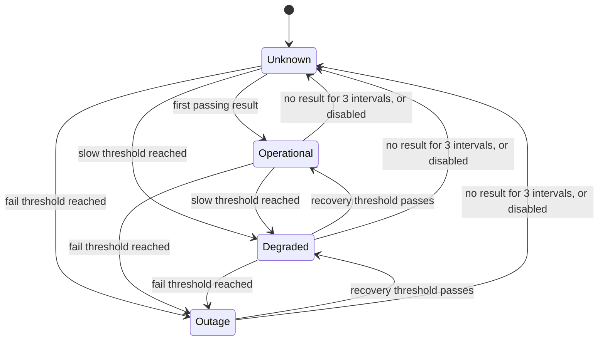
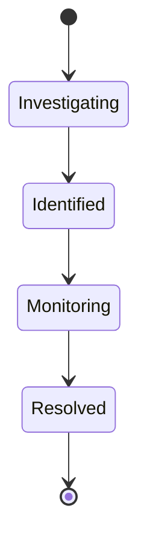

# Status Pulse: Architecture

> **Requirement: Architecture sketch.** The overview and system diagram come first, followed by the processes, the status and incident rules, and a table of concurrency guarantees with the test that verifies each. The data model is in [erd.md](erd.md).

## Overview

Status Pulse is four small programs that share one PostgreSQL database. Every "exactly once" rule in the requirements is enforced by a database constraint, so the rule still holds when two programs act at the same moment.


## Code layout

A single package with one `package.json` and one folder per process. Each process has its own entry file. The code is compiled with `tsc` to `dist/` and run with `node`.

```
src/
  api/         Express application: routes, middleware       entry: api/main.ts
  scheduler/   tick loop and sweeper                         entry: scheduler/main.ts
  worker/      claim a job, run the check, save the outcome  entry: worker/main.ts
  dispatcher/  deliver alerts from the outbox                entry: dispatcher/main.ts
  core/        status rules, state machines, URL safety, clock (no database access)
  db/          Prisma client and the raw SQL queries
prisma/        schema and migrations
```

`core/` does not import from `db/`, so the business rules are tested without a database.

## Processes

| Process | Responsibility | Reason for a separate process |
|---|---|---|
| **API** | Registration, login, projects, services, results, incidents, alerts, public page | Serves users and stays responsive regardless of check activity |
| **Scheduler** | Once a second, inserts one job per enabled service for the current interval slot. Also sweeps: marks stale jobs skipped, sets services with no recent result to Unknown, ends expired overrides | A tick loop with no other work |
| **Worker** | Claims a job, calls the endpoint under a hard timeout, then saves the result, status, incident and alert in one transaction | A slow endpoint delays only one worker; more workers can be added to scale |
| **Dispatcher** | Claims undelivered alerts from the outbox, sends them, retries failures with backoff | A failing mail provider cannot delay checks |

The shared test environment runs all four processes in a single Render web service, started by one launcher script.

## Life of a check

1. The scheduler inserts a job for the current slot. Slots are aligned to the Unix epoch, so every scheduler computes the same slot, and a unique constraint on (service, slot) turns a duplicate insert into a no-op.
2. A worker claims the oldest job of the current slot with a lease, using `FOR UPDATE SKIP LOCKED`, so two workers never receive the same job.
3. The worker calls the endpoint under a hard timeout. No database lock is held during the call.
4. The worker opens a transaction and locks the service row with `FOR UPDATE`.
5. Within that transaction it saves the result and calls `evaluate` to compute the status. If the status has entered Outage and no override is active, it opens the incident and creates the alert.
6. The transaction commits and the job is marked done.
7. The dispatcher delivers the alert and sets `delivered_at` only after a confirmed send.

A failure before the commit leaves nothing partially written. The lease expires, and another worker retries the job if its slot is still current.

## Status calculation

Status is calculated when an event occurs, stored on the service, and recorded in a history table. A change of status is therefore an event in its own right: it can open an incident even when no one is viewing the status page, and the public page reads a stored value.

A status changes in three kinds of moment. All three call one function, `evaluate`, which takes recent results, the active override and the current time and returns a status. The function performs no database access.

| Moment | Handled by |
|---|---|
| A check result arrives | Worker |
| The owner acts: override set or cancelled, service disabled or enabled, thresholds edited | API |
| Time passes: no result for three intervals, override expiry | Sweeper in the scheduler |

Each of them locks the service row before it decides, so two decisions cannot interleave.



- **Thresholds belong to the service** and are set by its owner: consecutive failures for Outage, consecutive passes for recovery, a latency limit that defines a slow result, and the number of consecutive slow results that make Degraded.
- **Streaks restart whenever a service enters Unknown.** Only results recorded after the latest Unknown transition are counted, so no separate counter has to be kept consistent.
- **An override replaces the displayed status** while it is active. Results are still recorded, but no new incident or alert is created, and an incident that is already open is unchanged.
- **Downtime is not caught up.** A job is only run while its slot is current. Stale jobs are marked skipped, so a restarted worker runs one check and then follows the normal interval. A scheduler that was down never created the missed jobs, because it always computes the slot from the current time.

## Incident lifecycle



Transitions occur in this order only; any other transition returns 409. The system opens incidents but does not resolve them. An incident takes its service's visibility, and an incident on a private service is never public.

## Concurrency guarantees

| Guarantee | Mechanism | Verified by |
|---|---|---|
| One job per service per slot | Epoch-aligned slot and `UNIQUE (service_id, scheduled_for)` | Several schedulers tick at once: one row per slot |
| A job is run by one worker | `FOR UPDATE SKIP LOCKED` with a lease | Many workers drain a queue: every job is claimed once |
| A crashed worker's job is retried | Lease expiry | Claim, let the lease expire, claim again |
| A retry creates no second result | `UNIQUE (job_id)` on results | Complete the same job twice: one result |
| No catch-up after downtime | Only current-slot jobs are claimed; the sweeper skips stale ones | Twenty stale jobs queued: one check runs |
| Status decisions do not interleave | Row lock on the service | Override and result arrive together: consistent outcome |
| One incident per outage | Partial unique index: one non-resolved incident per service | Two workers fail the same service: one incident |
| One alert per problem | `UNIQUE (service_id, incident_id, state)` | Repeated trigger: one alert |
| An alert is never marked delivered falsely | `delivered_at` set only after a confirmed send | Forced send failure: still null and retryable |
| A plan is charged once | `UNIQUE (project_id, idempotency_key)` | Same key twice: one activation |
| Removed members lose access at once | Role read from the database on every request | Role changed: the next request is refused |
| Private data stays private | Public routes read only public rows; row level security on every table | Private service absent from the public API |

## Security

- **Passwords:** hashed with bcrypt at cost 12. Passwords are limited to 72 bytes, because bcrypt ignores anything longer.
- **Sessions:** a 15-minute signed access token that carries only the user's identity, and a random refresh token stored as a hash and replaced on every use. Presenting an already-used refresh token revokes all of that user's sessions.
- **Permissions:** the role is read from the memberships table on every request. A non-member receives 404 and a member with an insufficient role receives 403.
- **Endpoint URLs:** validated when a service is saved. The worker validates again when connecting: it resolves the host name itself, rejects private, loopback and link-local addresses, and connects to the address it has just checked. Redirects are not followed. The second check is needed because a name that resolves to a public address at save time can resolve to an internal address later.
- **Credentials:** encrypted at rest with AES-256-GCM, never returned by the API, never logged. Only the worker decrypts them.
- **Logs:** Morgan records the method, path, status and duration, and never query strings, request bodies or authorization headers.
- **Database:** row level security is enabled on every table, so the Supabase Data API cannot read any of them. The application connects through the Supabase session pooler.

## Stack

| Component | Alternative considered | Reason |
|---|---|---|
| Node.js 22, TypeScript 6 compiled with `tsc` | TypeScript 7; esbuild-based runners | Compatible with the development machine (macOS 11) |
| Express 5 and Zod | | Express 5 passes errors from async handlers to the error middleware; Zod provides one schema for validation and types |
| PostgreSQL on Supabase, used only as a database | Supabase Auth and its client library | Authentication, permissions and privacy are core requirements and are implemented in this codebase |
| Prisma 7.10.0 with `@prisma/adapter-pg` and `pg` 8.23.0 for the model, migrations and ordinary queries; raw SQL for the claim, the lock and the one-incident rule | Raw SQL only | Prisma cannot express row locks or partial unique indexes |
| bcrypt 6 | scrypt, Argon2id | Listed by OWASP and widely understood |
| PostgreSQL as the job queue | Redis, RabbitMQ | One fewer service to run, and constraints provide the guarantees; throughput is lower, which suits small teams |
| Four separate processes | One process with timers | Multi-worker behaviour can be run and tested |
| Status calculated on write | Calculated on every read | A change of status is an event, and reads stay cheap |
| Role read from the database | Role stored in the token | A removed member loses access immediately |
| Simulated email through an outbox table | Real email delivery | Out of scope, and it makes failures and retries demonstrable |
| Vitest against a separate Supabase test project | Mocking the database | Concurrency tests need a real database |
| Render web service | Other hosts | Deploys directly from the repository |
