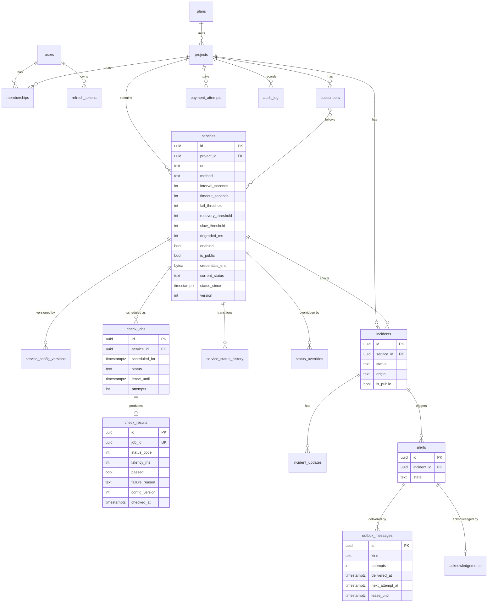

# Status Pulse: Data Model

> The data model behind the architecture sketch: tables, relationships, and the database constraints that enforce the "exactly once" requirements. The model is defined in `prisma/schema.prisma`. Constraints that Prisma cannot express are added in hand-written migration SQL and are marked below.

## Entity relationships



## Tables

| Area | Tables | Week |
|---|---|---|
| Accounts and access | `users`, `refresh_tokens`, `projects`, `memberships` | 2 |
| Services | `services`, `service_config_versions` | 2 |
| Checks | `check_jobs`, `check_results` | 2 |
| Audit and administration | `audit_log`, `scheduler_failures` | 2 |
| Status | `service_status_history`, `status_overrides` | 3 |
| Incidents | `incidents`, `incident_updates` | 3 |
| Alerts | `alerts`, `outbox_messages`, `acknowledgements` | 4 |
| Public pages and plans | `subscribers`, `subscriber_services`, `plans`, `payment_attempts` | 4 |

`outbox_messages` holds every simulated email: alerts, subscription verification and subscriber notifications. `check_results` stores `passed` and `latency_ms`; whether a result is slow is derived from the latency and the service's latency limit when the result is evaluated.

## Threshold defaults

| Setting | Default | Meaning |
|---|---|---|
| `fail_threshold` | 3 | Consecutive failures before `Outage` |
| `recovery_threshold` | 2 | Consecutive passes for each recovery step |
| `slow_threshold` | 3 | Consecutive slow results before `Degraded` |
| `degraded_ms` | none | Latency limit; a service without one never becomes `Degraded` |

## Constraints that enforce the guarantees

| Guarantee | Constraint | Defined in |
|---|---|---|
| One job per service per slot | `UNIQUE (service_id, scheduled_for)` on `check_jobs` | Prisma schema |
| One result per job | `UNIQUE (job_id)` on `check_results` | Prisma schema |
| One active incident per service | `CREATE UNIQUE INDEX ... ON incidents (service_id) WHERE status <> 'Resolved'` | Migration SQL |
| One alert per service, incident and state | `UNIQUE (service_id, incident_id, state)` on `alerts` | Prisma schema |
| One acknowledgement per alert | `UNIQUE (alert_id)` on `acknowledgements` | Prisma schema |
| One subscription per email and project | `UNIQUE (project_id, email)` on `subscribers` | Prisma schema |
| A plan is charged once | `UNIQUE (project_id, idempotency_key)` on `payment_attempts` | Prisma schema |
| Ordered configuration history | `UNIQUE (service_id, version)` on `service_config_versions` | Prisma schema |
| One membership per user and project | `PRIMARY KEY (project_id, user_id)` on `memberships` | Prisma schema |
| Valid states and roles | `CHECK` constraints on role, status, method and interval | Migration SQL |
| Timeout shorter than interval | `CHECK (timeout_seconds < interval_seconds)` on `services` | Migration SQL |
| Tables unreadable through the Data API | `ENABLE ROW LEVEL SECURITY` on every table, without policies | Migration SQL |

## Queue and lock queries

These are written as raw SQL because Prisma cannot express them. Times are passed in by the caller, so tests can move time.

**Enqueue (scheduler).** One job per enabled service for the slot containing `$now`. Slots are aligned to the Unix epoch, so every scheduler computes the same `scheduled_for`.

```sql
INSERT INTO check_jobs (service_id, scheduled_for)
SELECT s.id,
       to_timestamp(floor(extract(epoch FROM $1::timestamptz) / s.interval_seconds) * s.interval_seconds)
FROM services s
WHERE s.enabled AND s.deleted_at IS NULL
ON CONFLICT (service_id, scheduled_for) DO NOTHING;
```

**Claim (worker).** Only a job whose slot is still current can be claimed. An expired lease makes a job claimable again.

```sql
UPDATE check_jobs j
   SET status = 'leased',
       lease_until = $1::timestamptz + make_interval(secs => $2::double precision),
       attempts = j.attempts + 1
 WHERE j.id = (
   SELECT j2.id
     FROM check_jobs j2
     JOIN services s ON s.id = j2.service_id
    WHERE (j2.status = 'queued' OR (j2.status = 'leased' AND j2.lease_until < $1::timestamptz))
      AND j2.attempts < $3
      AND j2.scheduled_for <= $1::timestamptz
      AND j2.scheduled_for + make_interval(secs => s.interval_seconds) > $1::timestamptz
    ORDER BY j2.scheduled_for, j2.id
    FOR UPDATE OF j2 SKIP LOCKED
    LIMIT 1)
RETURNING j.*;
```

**Skip stale jobs (sweeper).**

```sql
UPDATE check_jobs j
   SET status = 'skipped', lease_until = NULL
  FROM services s
 WHERE s.id = j.service_id
   AND (j.status = 'queued' OR (j.status = 'leased' AND j.lease_until < $1::timestamptz))
   AND j.scheduled_for + make_interval(secs => s.interval_seconds) <= $1::timestamptz;
```

**Lock a service before changing its status.** Used by the worker, the API and the sweeper at the start of their final transaction.

```sql
SELECT * FROM services WHERE id = $1 FOR UPDATE;
```

## Privacy rules in the model

- `credentials_enc` is encrypted with AES-256-GCM. It is read only by the worker and is never selected by an API query.
- Public queries read only rows where `is_public` is true. They never read `memberships`, `audit_log` or internal incident updates.
- Every API response is built from an explicit response shape, so a new column cannot reach a client by accident.
- Row level security is enabled on every table. The application connects with a role that bypasses it, so the Supabase Data API and its public key can read nothing.
