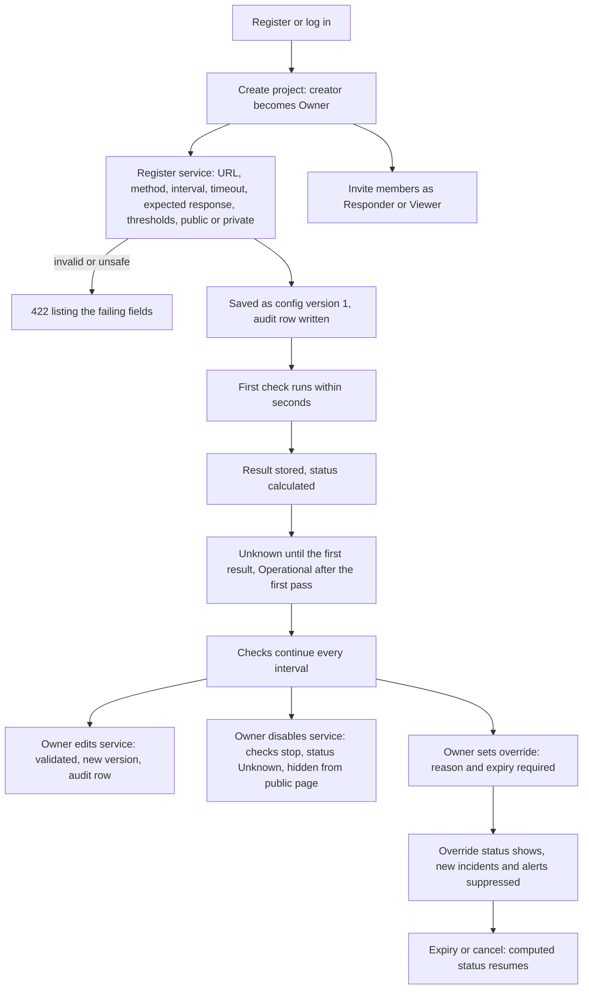
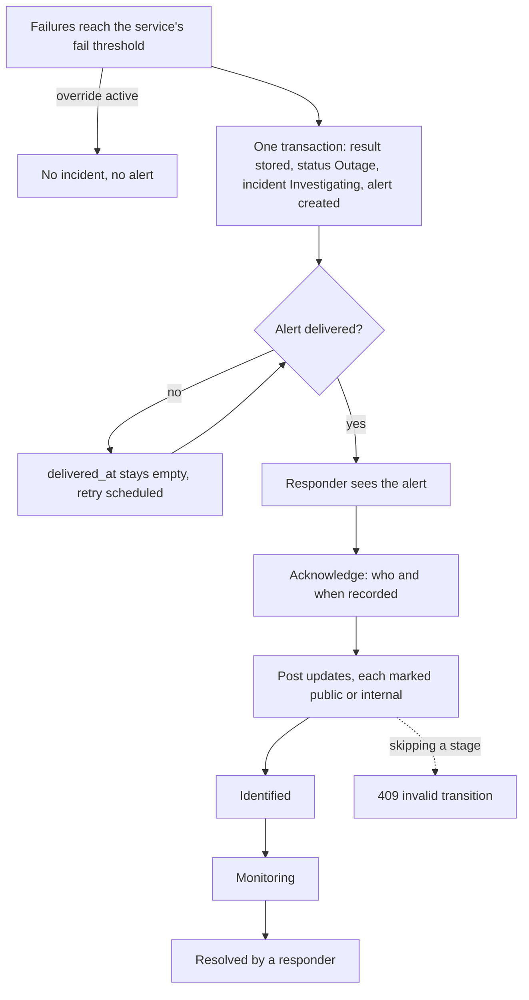
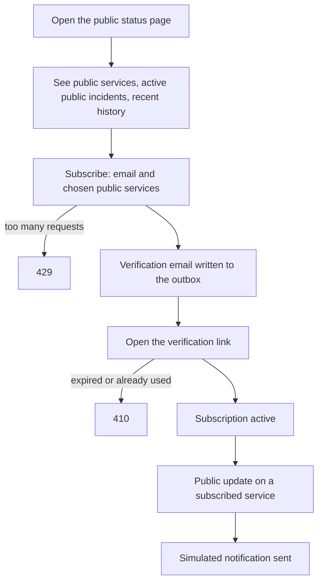
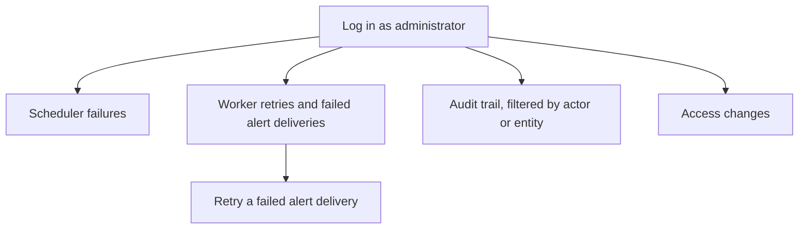

# Status Pulse: User Flows

> **Requirement: Learner-designed flows.** One flow per role, with failure branches shown. Diagrams are Mermaid, which renders on GitHub.

## 1. Developer / Project Owner

Session handling: the access token lasts 15 minutes. When it expires, the client sends its refresh token and receives a new pair. If the refresh token is expired or revoked, the user logs in again.

## 2. Incident Responder

The system never resolves an incident on its own. Passing checks bring the service back to Operational, and a responder decides when the incident is resolved.

## 3. Public Viewer / Subscriber

Subscribing twice with the same email does not create a second subscription. Private services are never listed and cannot be subscribed to.

## 4. Administrator

## Rules behind the flows

1. **Thresholds belong to the service.** The owner sets how many consecutive failures cause an outage, how many consecutive passes cause recovery, and for Degraded both a latency limit and how many slow results in a row count as degraded.
2. **Status.** A new service is Unknown. A first passing result makes it Operational. Moving into Degraded or Outage needs the full threshold. Recovery steps from Outage to Degraded to Operational, each step after the recovery threshold of consecutive passes. No result within three intervals returns the service to Unknown.
3. **One transaction.** Saving the result, updating the status, opening the incident and creating the alert happen together or not at all. If a worker crashes midway nothing is half-written, its job lease expires, and another worker retries the job.
4. **One active incident per service**, enforced by the database. Two workers finishing checks for the same service at the same moment cannot open two incidents.
5. **Visibility.** An incident takes its service's public or private setting. An incident on a private service can never be public. The owner may hide an incident of a public service. Each update is public or internal, and an update on a non-public incident is always internal.
6. **Override.** While active it shows instead of the computed status. Checks keep being recorded, but no new incident or alert is created. An incident that is already open is untouched. When the override ends, the computed status resumes and may open an incident then.
7. **Disabled service.** No checks, status shows Unknown, and it does not appear on the public page. Re-enabling resumes checks.
8. **Every change is audited** with who did it and when: service configuration, overrides, member roles, incident and acknowledgement actions, plan changes.
